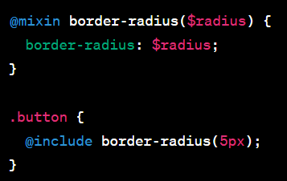

<h1>Sass Kavramları</h1>

Partial:Partial, genellikle _ ile başlayan ve başka SCSS veya SASS dosyalarında kullanılmak üzere oluşturulan dosyalardır. Partials, ana stil dosyalarını daha düzenli ve yönetilebilir hale getirmek için kullanılır. Örneğin, 'variables.scss' veya 'mixins.scss' gibi parçalı dosyalar oluşturabilirsiniz.

@import:'@import' yönergesi, bir SCSS veya SASS dosyasından başka bir dosyayı içe aktarmak için kullanılır. Partials'ı başka dosyalarda kullanmak veya dışarıdan kaynakları projenize eklemek için bu yönergeyi kullanabilirsiniz.

Watch SCSS: SCSS veya SASS dosyalarını otomatik olarak izlemek için kullanılan bir işlem. Bir SCSS dosyası değiştirildiğinde, bu dosyayı derleyebilir ve sonuçları güncelleyebilir.

Sass Değişkenleri: Sass veya SCSS değişkenleri, belirli bir değeri saklamak için kullanılır. '$' sembolü ile başlarlar ve herhangi bir veri türünü temsil edebilirler. Örneğin, '$main-color: #3498db;' gibi bir değişken tanımlayabilir ve stil kurallarınızda bu değişkeni kullanabilirsiniz.

Function ve Mixin Örneği: SCSS, işlevler ve karışımları (mixins) tanımlamanıza olanak tanır. İşlevler, hesaplamalar yapmak veya değerleri dönüştürmek için kullanılır. Mixins ise belirli stil kurallarını tekrar kullanılabilir hale getirir. Örnek bir mixin:

Include (İçe Aktarma): @include yönergesi, bir mixin'i stil kurallarınızda kullanmak için kullanılır. Yukarıdaki örnekte görüldüğü gibi, mixin'i belirli bir stil kurallarına dahil etmek için '@include' kullanılır.

Extend Parametresi: SCSS'de @extend kullanarak stil kurallarını başka bir stil kuralına genişletebilirsiniz. Bu, belirli bir stil kuralını başka bir stil kuralıyla birleştirmek ve kodunuzu daha temiz ve DRY (Don't Repeat Yourself) tutmak için kullanılır.

<h2>Özetle, SCSS ve SASS, CSS yazarken daha iyi organizasyon, tekrar kullanılabilirlik ve kolaylık sağlayan özelliklere sahip CSS derleme dilleridir. Partials, değişkenler, karışımlar ve diğer özellikler, stil kodunuzu daha etkili bir şekilde yönetmenizi sağlar.</h2>